# 🦇 Iron Bat — Tech-Noir Code Assistant

A cyberpunk-styled, AI-powered code analysis and diagnostic platform built with the **Gemini API**. Iron Bat reads your active code file, answers questions about it in a gritty "tech-noir" diagnostic voice, traces execution call-chains across your codebase, and lets you explore repositories like a command-center console.

Built entirely inside **Google AI Studio** (Build mode) with the **Antigravity agent**, designed as a **mobile-first web app** — deployable to any Node hosting, no Google Cloud billing required.

---

## 🧠 What It Does

| Feature | Description |
|---|---|
| 💬 **AI Code Chat** | Ask questions about the file you're viewing (`Explain authenticateUser`) — Gemini answers with bullet-point diagnostics in character. |
| 🕵️ **Execution Tracing** | Ask for a **Trace Sequence** and Iron Bat generates a 3-step cross-file call-chain (file, line range, highlighted code, explanation). |
| 📄 **Code Viewer** | Interactive, syntax-coloured file browser with click-a-line-to-ask (tap a line → "Explain line 12: ..."). |
| 📂 **Repo Command Center** | Browse a multi-file mock codebase (auth, API client, config, UI), search files, jump instantly between views. |
| 🎙️ **Voice Input** | Tap the mic for a voice-prompted analysis (microphone permission requested). |
| 🎨 **Tech-Noir UI** | Dark, glowing-neon interface (`#00F2FE` cyan accents), draggable code/chat split-pane, animated transitions. |
| ⚠️ **Graceful Fallback** | If no `GEMINI_API_KEY` is configured, the server answers from a smart offline diagnostic engine — the demo never breaks. |

---

## 🏗️ Tech Stack

| Layer | Technology |
|---|---|
| Frontend | React 19, Vite 6, Tailwind CSS v4, Motion (Framer Motion), Lucide icons |
| Backend | Node.js + Express 4, TypeScript (esbuild bundle → single `server.cjs`) |
| AI | Google Gemini via `@google/genai` SDK (model: `gemini-3.6-flash`), JSON response mode for traces |
| Build | Vite (client) + esbuild (server) — one-command `npm run build` |

---

## 🔁 System Flow Diagram

```mermaid
flowchart TD
    U[User in mobile browser] -->|tap line / type question| F[React UI - Iron Bat Console]
    F -->|POST /api/chat| S[Express Server]
    F -->|POST /api/trace| S
    F -->|GET /api/health| S

    subgraph S [Node + Express Backend]
        C{Has GEMINI_API_KEY?}
        C -- No --> D[Offline Diagnostic Engine - fallback replies]
        C -- Yes --> G[Gemini SDK - google-genai]
    end

    G -->|gemini-3.6-flash + file context + history| M[(Gemini API - Free tier)]
    M -->|bullet diagnostics, JSON traces| G
    D --> R[reply + status + suggestions]
    G --> R
    R --> F
    F -->|Render bullets, trace cards, citations| U

    style G fill:#0b3d5c,stroke:#00F2FE
    style D fill:#3d2b0b,stroke:#f2c800
    style M fill:#1c1c26,stroke:#3A3A44
```



```
                                ┌──────────────────────────┐
                                │      Iron Bat UI (SPA)   │
                                │  React + Tailwind + Motion│
                                └────────────┬─────────────┘
                          /api/chat           │           /api/trace
                                 ▼            ▼                 ▼
                       ┌────────────────────────────────────────────┐
                       │        Express Server  (server.ts)          │
                       │    /api/health → status check               │
                       │    /api/chat   → question + file context    │
                       │    /api/trace  → call-chain JSON            │
                       └──────┬──────────────────────────┬──────────┘
                              │ has API key?             │ no API key?
                              ▼                          ▼
                     ┌─────────────────┐         ┌──────────────────┐
                     │  Gemini Flash   │         │ Offline Fallback │
                     │  (@google/genai)│         │ Engine (demo)     │
                     └─────────────────┘         └──────────────────┘
```

**Flow, step by step:**
1. The user opens the console and selects a code file (e.g. `Auth.js`).
2. They tap a line or type a question — the UI sends the **active file content + last 4 messages** to `/api/chat`.
3. The server wraps it in an "Iron Bat" system persona and calls `gemini-3.6-flash` (temperature 0.4).
4. Gemini returns diagnostics; the UI splits `›`-styled bullets into an animated response card with suggestions.
5. For `/api/trace`, Gemini returns **strict JSON** (`{ steps: [{file, lines, code, highlight}], explanation }`) rendered as a timeline sequence.

---

## 🚀 Deployment (Free — No Google Billing Needed)

This app is a standard Node app. Deploy it free on **Render** and connect it to your GitHub repo — deploys automatically on every push, and the Gemini key lives in **GitHub Secrets** via a GitHub Actions workflow.

### 1. One-time: create your secrets on GitHub
Repo → **Settings → Secrets and variables → Actions → New repository secret**:

| Secret | Value |
|---|---|
| `GEMINI_API_KEY` | Your Gemini API key from [aistudio.google.com](https://aistudio.google.com) |
| `RENDER_API_KEY` | `render.com → Account Settings → API Keys` |
| `RENDER_DEPLOY_HOOK_URL` | `render.com → your service → Settings → Deploy Hook` (copy URL) |
| `RENDER_SERVICE_ID` | Your Render service ID (the `srv-...` string from the service URL) |

### 2. Create your free service on Render
1. Go to [render.com](https://render.com) → **New → Blueprint** → connect your GitHub repo.
2. Render reads `render.yaml` and creates the app automatically.
3. Set `GEMINI_API_KEY` in the service's **Environment** tab (or let the workflow push it).

### 3. Deploy
- Easiest: **Manual Deploy → Deploy branch** in Render (first deploy), then every `git push` triggers the **GitHub Actions workflow** (`.github/workflows/deploy.yml`) which syncs the API key from GitHub Secrets and hits the Deploy Hook. Zero manual steps after setup.

> No API key? The app still runs in **demo mode** with the offline diagnostic fallback — every screen works.

---

## 🖥️ Run Locally

```bash
# 1. Install deps
npm install

# 2. Add your API key
cp .env.example .env    # then set GEMINI_API_KEY="your-key"

# 3. Dev server (hot reload, Vite middleware)
npm run dev             # → http://localhost:3000

# 4. Production build + serve
npm run build && npm start

# 5. Lint
npm run lint
```

---

## 🔌 API Endpoints

| Method | Path | Request Body | Returns |
|---|---|---|---|
| `GET` | `/api/health` | — | `{ status, hasGeminiKey, timestamp }` |
| `POST` | `/api/chat` | `{ message, fileContext: { name, content }, history: [{role, text}] }` | `{ reply, status, suggestions, isFallback }` |
| `POST` | `/api/trace` | `{ functionName, codeSnippet }` | `{ steps: [{file, lines, code, highlight}], explanation }` |

---

## 📁 Project Structure

```
├── server.ts                 # Express server: Gemini client, /api/chat, /api/trace
├── vite.config.ts            # Vite + React + Tailwind
├── package.json              # build: vite build && esbuild server
├── .env.example              # GEMINI_API_KEY / APP_URL template
├── render.yaml               # Render Blueprint (free tier, auto-deploy)
├── .github/workflows/        # GitHub Actions: secret sync + deploy hook
└── src/
    ├── App.tsx               # Console shell, pane split, tab routing
    ├── data/mockCodebase.ts  # Built-in demo codebase (auth, api, config...)
    ├── types.ts
    └── components/
        ├── AIChatPane.tsx        # Streaming chat + mic input
        ├── CodeViewer.tsx        # Syntax-highlighted file viewer
        ├── TraceSequenceView.tsx # Call-chain timeline
        ├── ReposView.tsx         # Repo command center
        ├── ConfigView.tsx        # Settings
        ├── SearchModal.tsx       # File search
        ├── Header.tsx / Navigation.tsx
```

---

## 🎓 What This Teaches (Build-with-AI / Bootcamp Notes)

- **Agentic build flow**: designed in **Google Stitch** → implemented by the **Antigravity agent** in **AI Studio Build** → deployed to Cloud Run → re-hosted on free infrastructure (this repo).
- **Prompt architecture**: system persona + file context + conversation history → stable, character-consistent outputs.
- **Structured outputs**: `/api/trace` forces `responseMimeType: application/json` — deterministic data the UI can render.
- **Server-side key management**: the Gemini key never ships to the browser; the Express server proxies all AI calls.
- **Fallback design**: the app degrades gracefully without an API key — great for demos and CI.

---

## 🛠️ Troubleshooting

| Problem | Fix |
|---|---|
| Render shows `NODE_ENV` issues | `render.yaml` sets `NODE_ENV=production` automatically |
| Blank screen in production | Confirm `/api/health` returns `status: ok` — SPA fallback sends `index.html` on all routes |
| "AI Diagnostic Scan Failure" | Check `GEMINI_API_KEY` in Render env (or GitHub Secret sync) and that you're on the free Gemini tier |
| Changes not auto-deploying | Verify the `push` workflow ran in **Actions** tab and the Deploy Hook URL secret is correct |

---

Built with 🦇 by [@108tsrenukesh](https://github.com/108tsrenukesh) — Google Build with AI Bootcamp project.